# ✨ `hewel.dev`'s Character Sheet ✨

<em>"Code Alchemist • Gaming Ranger • Pixel Art Appreciator"</em>

[%E1%95%97+Welcome+to+my+world!;Frontend+Developer+%40+hewel;Leveling+up+one+commit+at+a+time!;Initializing+cute+developer+profile...)](https://git.io/typing-svg)

---

<table align="center" width="100%">
  <tr>
    <td width="33%" valign="top">
      <h3>⚔️ Player Info</h3>
      <ul>
        <li><strong>Name:</strong> Hewel</li>
        <li><strong>Class:</strong> <code>Frontend Mage 🔮</code></li>
        <li><strong>Subclass:</strong> <code>React Alchemist 🧪</code></li>
        <li><strong>Level:</strong> 24 <em>(Next level at 5,000 commits)</em></li>
        <li><strong>Guild:</strong> Open Source Adventurers 🌐</li>
      </ul>
    </td>
    <td width="33%" valign="top">
      <h3>📊 Character Attributes</h3>
      
<strong>INT (Intelligence)</strong>   <code>████████░░</code> 80% <em>(React Hooks & Logic)</em>

      
<strong>DEX (Dexterity)</strong>   <code>█████████░</code> 90% <em>(CSS Layouts & Responsive Grids)</em>

      
<strong>VIT (Vitality)</strong>   <code>██████░░░░</code> 60% <em>(Coffee-to-Code conversion rate)</em>

      
<strong>AGI (Agility)</strong>   <code>████████░░</code> 80% <em>(Hot Reload speed with Vite)</em>

    </td>
    <td width="34%" valign="top">
      <h3>🐾 Active Companion</h3>
      <pre align="left">
    /\_/ \
   ( o.o )  <em>"Meow! Welcome, traveler!</em>
    > ^ <   <em>Hewel is currently crafting</em>
   /  |  \  <em>awesome web spells!"</em>
  (______/
      </pre>
      

        
      

      

        
      

    </td>
  </tr>
</table>

---

### 🛠️ Spells & Equipment (Tech Stack)

| Category | Tools & Technologies |
| :--- | :--- |
| **Languages** |  |
| **Libraries & Frameworks** |  |
| **Artifacts & Gear** |  |

---

### 📜 Active Quests

- [x] **Quest 1: Streamline GitHub Insights** — *Transitioned profile to clean github-readme-stats.* `[REWARD: Clean Profile Badge 🏅]`
- [ ] **Quest 2: Master Rust Spellcasting** — *Leveling up systems programming knowledge.* `[PROGRESS: ████░░░░░░ 40%]`
- [ ] **Quest 3: Build the Ultimate UI Artifact** — *Developing a new open-source component library.* `[XP +500]`

---

### 📊 Profile Chronicles (GitHub Insights)

  

  

